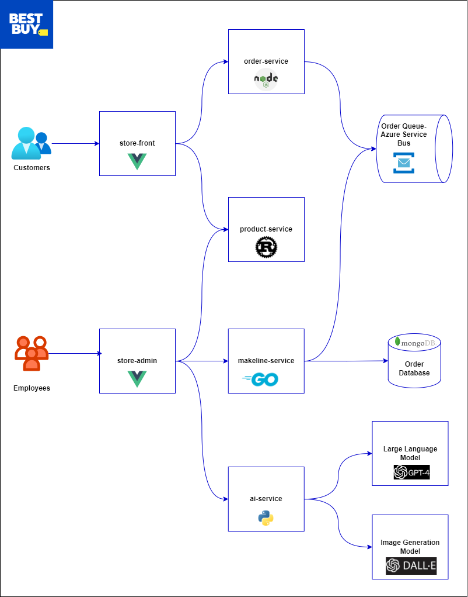

# Best Buy Store Application

Welcome to the Best Buy Store application.

The Best Buy Store Application is a cloud-native, microservices-based e-commerce demo app designed to showcase modern application architecture principles. The app uses a polyglot programming approach, an event-driven design, and leverages both managed and open-source backing services. By deploying this application in a Kubernetes cluster, you can explore the benefits of container orchestration and cloud-native technologies.

Key features include:

- Customer-facing Store-Front: Enabling users to browse and place orders.
Employee-focused Store-Admin: Facilitating product management and order tracking.
- AI Integration: Harnessing GPT-4 and DALL-E for generating intelligent product descriptions and creative images.
- Event-Driven Order Processing: Using Azure Service Bus for scalable and reliable messaging.
- Persistent Data Storage: MongoDB for storing product and order information.
- Microservices Architecture: Independent services built with different technologies (Vue.js, Node.js, Rust, Python, Go).

The application demonstrates modern software development practices, including infrastructure as code, containerization, and managed services integration, making it a powerful example of a full-stack cloud-native solution.

## Architecture

The application has the following services: 

| Service | Description | Github Repo |
| --- | --- | --- |
| `store-front` | Web app for customers to place orders (Vue.js) | [store-front](https://github.com/aka-pharande/CST8915-LA2-Store-Front) |
| `store-admin` | Web app used by store employees to view orders in queue and manage products (Vue.js) | [store-admin](https://github.com/aka-pharande/CST8915-LA2-Store-Admin) |
| `order-service` | This service is used for placing orders (Javascript) | [order-service](https://github.com/aka-pharande/CST8915-LA2-Order-Service) |
| `product-service` | This service is used to perform CRUD operations on products (Rust) | [product-service](https://github.com/aka-pharande/CST8915-LA2-Product-Service) |
| `makeline-service` | This service handles processing orders from the queue and completing them (Golang) | [makeline-service](https://github.com/aka-pharande/CST8915-LA2-Makeline-Service) |
| `ai-service` | Optional service for adding generative text and graphics creation (Python) | [ai-service](https://github.com/aka-pharande/CST8915-LA2-AI-Service) |
| `mongodb` | MongoDB instance for persisted data | [mongodb](https://github.com/docker-library/mongo) |
| `virtual-customer` | Simulates order creation on a scheduled basis (Rust) | [virtual-customer](https://github.com/aka-pharande/CST8915-LA2-Virtual-Customer) |
| `virtual-worker` | Simulates order completion on a scheduled basis (Rust) | [virtual-worker](https://github.com/aka-pharande/CST8915-LA2-Virtual-Worker) |

## Getting Started

For detailed deployment instructions, see the [Deployment Guide](./Deployment-guide.md).

